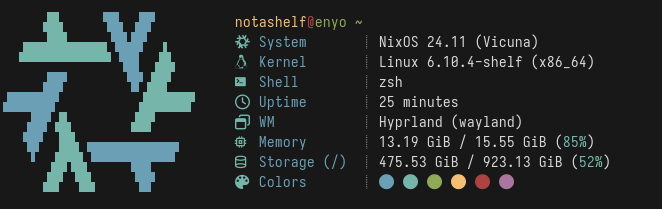

<div align="center">
    
    <!--  -->
    
</div>

<h1 align="center">Microfetch</h1>

Stupidly simple, laughably fast fetch tool. Written in Rust for speed and ease
of maintainability. Runs in a _fraction of a millisecond_ and displays _most_ of
the nonsense you'd see posted on r/unixporn or other internet communities. Aims
to replace [fastfetch](https://github.com/fastfetch-cli/fastfetch) on my
personal system, but [probably not yours](#customizing). Though, you are more
than welcome to use it on your system: it's pretty [fast...](#benchmarks)

<p align="center">
  
</p>

## Features

- Fast
- Really fast
- Minimal dependencies
- Actually really fast
- Cool NixOS logo (other, inferior, distros are not supported)
- Reliable detection of following info:
  - Hostname/Username
  - Kernel
    - Name
    - Version
    - Architecture
  - Current shell (from $SHELL, trimmed if store path)
  - Current Desktop (DE/WM/Compositor and display backend)
  - Memory Usage/Total Memory
  - Storage Usage/Total Storage (for `/` only)
  - Shell Colors
- Did I mention fast?

## Motivation

Fastfetch, as its name indicates, a very fast fetch tool written in C, however,
I am not interested in any of its additional features and I very much dislike
the defaults. Microfetch is a fetch tool that you would normally write in Bash
and put in your `~/.bashrc` but actually _really_ fast because it opts-out of
all customization options provided by Fastfetch. Why? Because I can.

I cannot re-iterate it enough, Microfetch is annoyingly fast.

## Benchmarks

Microfetch's performance is mostly hardware-dependant, however, the overall
trend seems to be < 2ms on any modern (2015 and after) CPU. Below are the
benchmarks with Hyperfine on my desktop system.

| Command      |   Mean [ms] | Min [ms] | Max [ms] |       Relative | Written by raf? |
| :----------- | ----------: | -------: | -------: | -------------: | --------------: |
| `microfetch` |   1.3 ± 0.0 |      1.3 |      1.4 |           1.00 |             yes |
| `fastfetch`  |  31.9 ± 0.8 |     30.8 |     33.8 |   24.08 ± 0.98 |              no |
| `pfetch`     | 254.2 ± 4.8 |    246.7 |    264.9 |  191.97 ± 7.10 |              no |
| `neofetch`   | 735.4 ± 9.5 |    721.1 |    752.8 | 555.48 ± 19.08 |              no |

_As far as I'm concerned, Microfetch is faster than almost every fetch tool
there is. The only downside of using Rust is introducing more "bloated"
dependency trees and increasing build times. The latter is easily mitigated with
Nix's binary cache, though._

[Criterion.rs]: https://github.com/bheisler/criterion.rs
[Getting Started Guide]: https://bheisler.github.io/criterion.rs/book/getting_started.html

To benchmark individual functions, [Criterion.rs] is used. See Criterion's
[Getting Started Guide] for details or just run `cargo bench` to benchmark all
features of Microfetch.

## Installation

Microfetch is packaged in [nixpkgs](https://github.com/nixos/nixpkgs). You can
get it through the unstable channel for the time being. The Nix flake can also
be used for bleeding-edge builds.

Non-Nix users will have to build Microfetch with `cargo`. It is not published
anywhere but I imagine you can use `cargo install --git` to install it from
source.

```bash
cargo install --git https://github.com/notashelf/microfetch.git
```

Microfetch is _currently_ not available anywhere else. Though, does it _really_
have to be?

## Customizing

You can't.

### Why?

Customization, of any kind, is expensive: I could try reading environment
variables, parse command-line arguments or read a configuration file but all of
those increment execution time and resource consumption by a lot.

### Really?

To be fair, you _can_ customize Microfetch by, well, patching it. It's not the
best way per se, but it will be the only way that does not compromise on speed.

The Nix package allows passing patches in a streamlined manner by passing
`.overrideAttrs` to the derivation.

## Contributing

I will, mostly, reject feature additions. This is not to say you should avoid
them altogether, as you might have a really good idea worth discussing but as a
general rule of thumb consider talking to me before creating a feature PR.

Contributions that help improve performance in specific areas of Microfetch are
welcome. Though, prepare to be bombarded with questions if your changes are
large.

## Hacking

A Nix flake is provided. `nix develop` to get started. Direnv users may simply
run `direnv allow` to get started.

Non-nix users will need `cargo` and `gcc` installed on their system, see
`Cargo.toml` for available release profiles.

## Thanks

Huge thanks to everyone who took the time to make pull requests or nag me in
person about current issues. To list a few, special thanks to:

- [@Nydragon](https://github.com/Nydragon) - For packaging Microfetch in Nixpkgs
- [@ErrorNoInternet](https://github.com/ErrorNoInternet) - Performance
  improvements and code assistance
- [@SoraTenshi](https://github.com/SoraTenshi) - General tips and code
  improvements
- [@bloxx12](https://github.com/bloxx12) - Performance improvements and
  benchmarking plots
- [@sioodmy](https://github.com/sioodmy) - Being cute
- [@mewoocat](https://github.com/mewoocat) - The awesome NixOS logo ASCII used
  in Microfetch

Additionally a big thank you to everyone who used, talked about or criticized
Microfetch. I might have missed your name here, but you have my thanks.

## License

Microfetch is licensed under [GPL3](LICENSE). See the license file for details.
